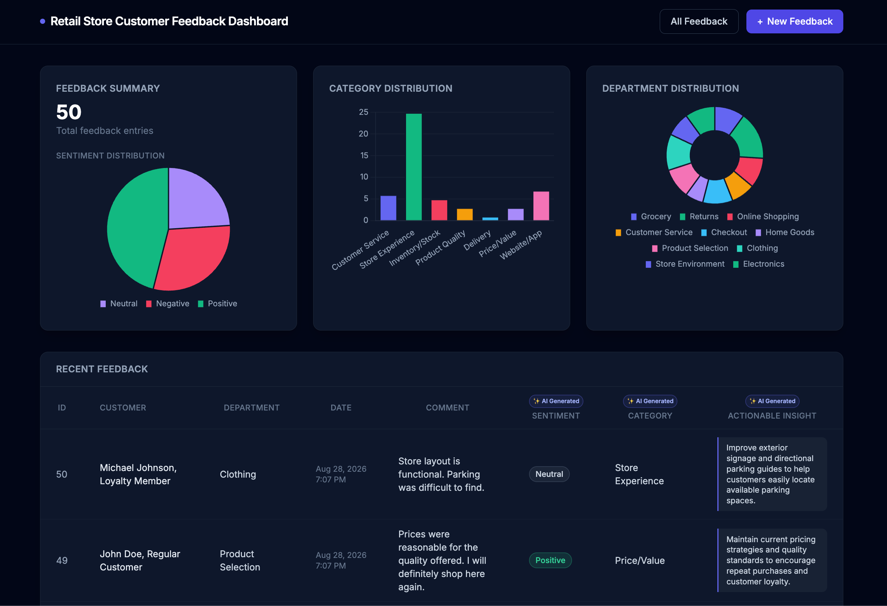
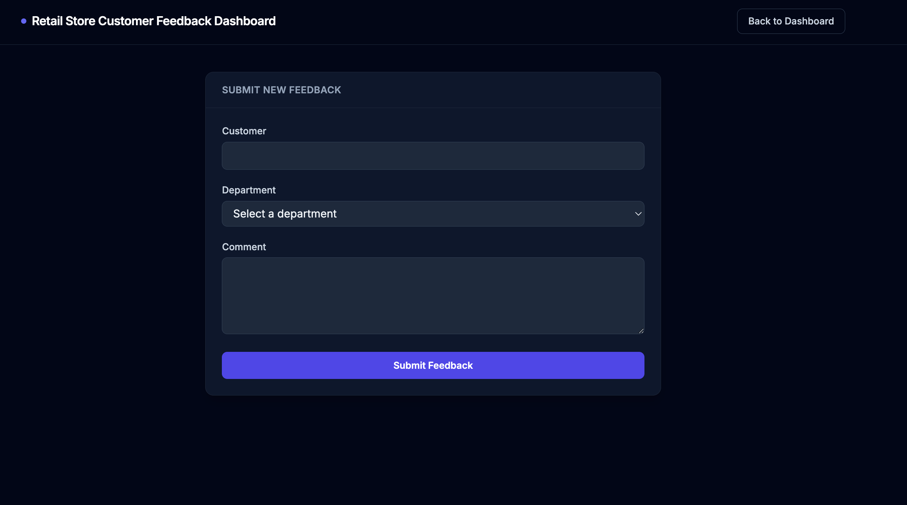
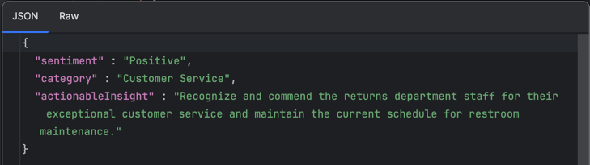
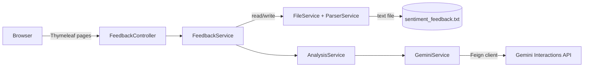

# Feedback Analyser

A retail customer feedback dashboard that uses Google Gemini to automatically tag sentiment, categorize each comment, and suggest an action — no manual tagging required.


## Screenshots

**Dashboard**



**Submitting new feedback**



## Overview

Feedback Analyser reads customer feedback (customer, department, comment) and enriches every entry with AI-generated sentiment, category, and a concrete actionable insight, then shows it all on a dashboard with charts and a searchable feedback list. It's a small, self-contained Spring Boot app — feedback is stored in a plain text file rather than a database, so there's nothing to provision before you run it. You can also submit new feedback straight from the UI and watch Gemini analyse it in real time.

## Features

- **Dashboard with live charts** — sentiment, category, and department distributions rendered with Chart.js, with sentiment colors fixed (green/red/purple) so they read consistently no matter how the data is ordered.
- **AI-tagged feedback table** — every row shows sentiment, category, and an actionable insight, each clearly labeled "AI Generated" so it's obvious what's model output vs. raw data.
- **Full feedback list** — a dedicated page listing every entry, most recent first.
- **New feedback form** — submit a customer, pick a department from a dropdown, write a comment, and Gemini analyses it on save.
- **Structured Gemini output, not regex scraping** — the Gemini request is built with a JSON Schema (`ResponseFormat` + `GenerationConfig`) so the model's response is constrained to exactly the fields the app needs, parsed straight into a `FeedbackAnalysis` record with Jackson.
- **Graceful degradation** — if the Gemini call fails or returns something unexpected, the app falls back to a clear "Uncategorized" state instead of crashing the page.
- **No database required** — feedback is persisted to a flat text file and parsed back into objects on read.
- **Unit tested Gemini client** — `GeminiServiceTest` and `InteractionResponseTest` cover the request-building and response-parsing logic with Mockito.


## How the AI integration works

Instead of prompting Gemini for free text and hoping it comes back as parseable JSON, this app sends a JSON Schema alongside the prompt (via the Gemini Interactions API's `response_format`), constraining the model to return exactly `sentiment`, `category`, and `actionableInsight` — nothing more, nothing malformed:



That response is deserialized directly into a Java record with Jackson, so there's no brittle string parsing in the middle.

## Architecture



## Quick Start

**Prerequisites:** Java 21, and a [Gemini API key](https://ai.google.dev/).

```bash
# set your Gemini API key
export GEMINI_API_KEY=your-key-here

# run the app
./mvnw spring-boot:run

# run the tests
./mvnw test
```

Then open `http://localhost:8080`.
